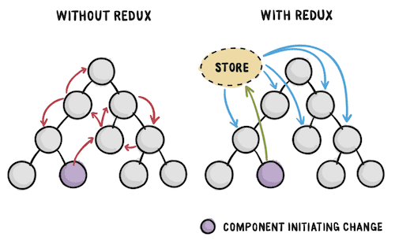
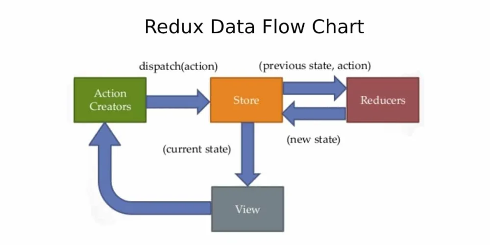

# Redux Statement Library

## 리덕스란?

**Redux는 action이라는 이벤트를 통해 애플리케이션의 상태를 관리하고 업데이트하기 위한 패턴이자 라이브러리이다.**

- 전역 상태로 사용애햐하는 중앙 저장소 역할을 하게되며, 예측 가능한 방식으로만 상태를 업데이트할 수 있도록하는 규칙을 지정합니다.
- 현재 Redux 팀 내에서도 Redux 대신 Redux-toolkit의 사용을 **강력히 권고**하고 있습니다.

<p align="center"></p>

### 리덕스를 사용해야하는 이유는 뭘까요?

**Redux를 사용하면 애플리케이션의 여러 부분에 필요한 "전역적인 상태"를 관리할 수 있습니다.**

- Redux에서 제공하는 도구를 사용하면 애플리케이션의 상태가 언제,어디서,왜,어떻게 업데이트 되는지
  - 그리고 이러한 변경이 발생할 때 로직이 어떻게 작동되는지 더 쉽게 이해할 수 있습니다.
- 최종적으로 예측 가능하고 테스트가 용이한 로직을 작성하도록 안내합니다.

### 리덕스의 데이터 플로우



## Action

**액션은 type 프로퍼티가 존재하는 일반적인 자바스크립트 객체입니다.**

- 액션은 애플리케이션에서 발생하는 일을 설명하는 이벤트입니다.
  - type : 작업에 대한 이름을 부여하는 문자열이어야 합니다.
    - 일반적으로 **"도메인/이벤트 명"**과 같은 유형의 문자열로 작성됩니다.
  - payload : 액션 객체에 어떤 일이 일어났는지에 대한 추가 정보가 담긴 필드입니다.
- 최종적으로 Action 객체는 다음과 같이 보입니다.

```js
const addTodoAction = {
  type: "todos/todoAdd",
  payload: "Redux 공부하기",
};
```

## Action Createor

**액션 크리에이터는 액션 객체를 생성하고 반환하는 함수입니다**

- 일반적으로 액션 객체를 매번 직접 작성할 소요를 줄이기 위해 사용하게 됩니다.

```js
const addTodo = (text) => {
  return {
    type: "todos/todoAdd",
    payload: text,
  };
};
```

## Reducer

**리듀서는 현재 상태와 액션 객체를 수신하고, 필요한 경우에 따라 상태를 업데이트하는 방법을 결정한 후 새로운 상태를 반환하는 함수입니다.**

- 리듀서는 수신된 액션의 타입에 따라 이벤트를 처리하는 이벤트 리스너와 같이 동작한다고 생각하면 됩니다.

```js
const initialState = {value: 0};

function counterReducer(state = initialState, action) {
  switch (action.type) {
    case "counter/increment":
      return {
        ...state,
        value: state.value + 1,
      };

    /* 리듀서에서 type이 존재하지 않을 경우 기존 상태를 변경하지 않고 반환합니다*/
    default:
      return state;
  }
}
```

### Reducer 작성 시 지켜야할 규칙들

1. 상태 와 액션을 기반으로 새로운 상태 값만을 작성해야합니다.
2. 기존 상태를 수정할 수 없습니다 ❌(따라서 복사를 통해 복사된 값을 변경하는 방식으로 업데이트를 수행해야 합니다.)
3. 로직 이외에 부수효과를 일으키는 로직은 작성하면 안됩니다 ❌ (리듀서는 순수함수로만 구현해야합니다.)

## Dispatch

**configureStore로 만든 store 내부에는 dispatch라는 함수가 존재합니다**

- 상태를 업데이트 하는 **유일한 방법은 store.dispatch()를 호출하고 액션객체를 전달**하는 것입니다.
- 스토어는 리듀서 함수를 실행하고 새로운 상태값을 저장하게 되며, getState()를 통해 업데이트된 값을 참조할 수 있게됩니다.

```js
store.dispatch({type: "counter/increment"});

console.log(store.getState()); // 1
```

<br />
<br />

## 🏊‍♂️ Redux-Toolkit으로 Todolist 만들기

**Redux-Toolkit으로 Todolist를 만들며 직접 학습합니다.**

- 자세한 설명은 [Redux로 TodoList 만들기](./todoApp/README.md)에서 확인하실 수 있습니다.
